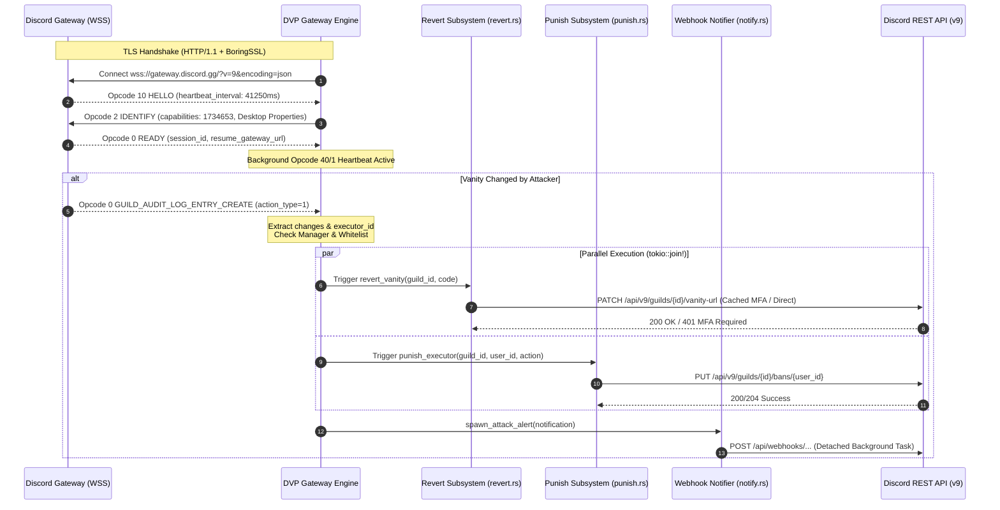
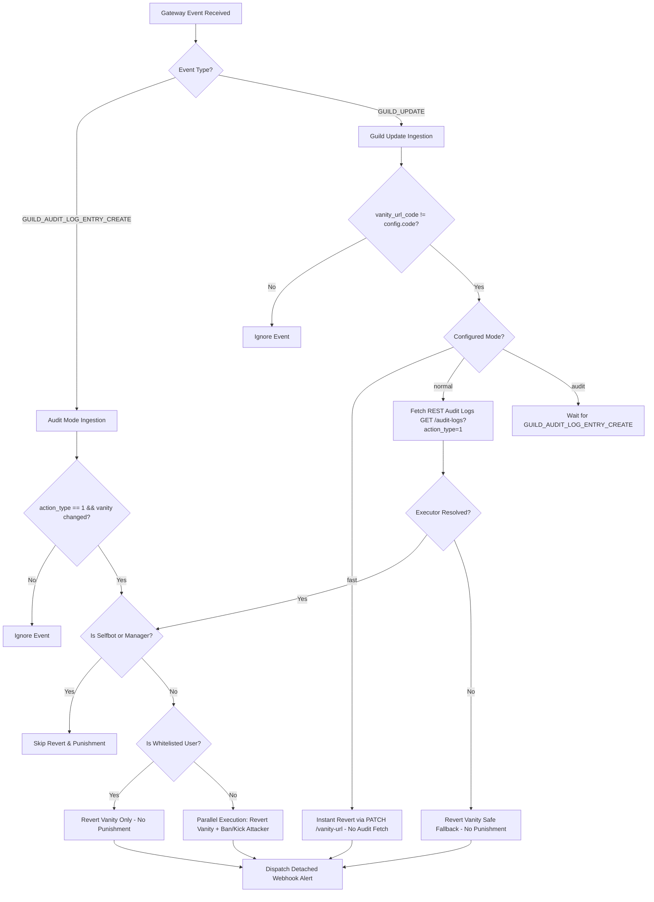
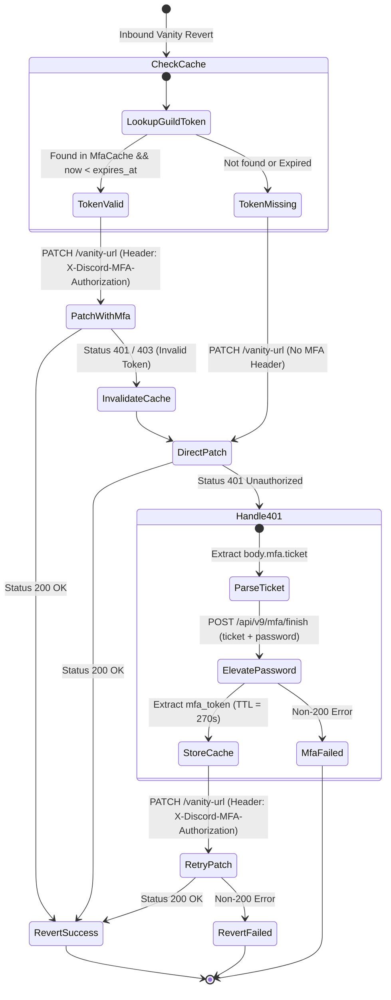
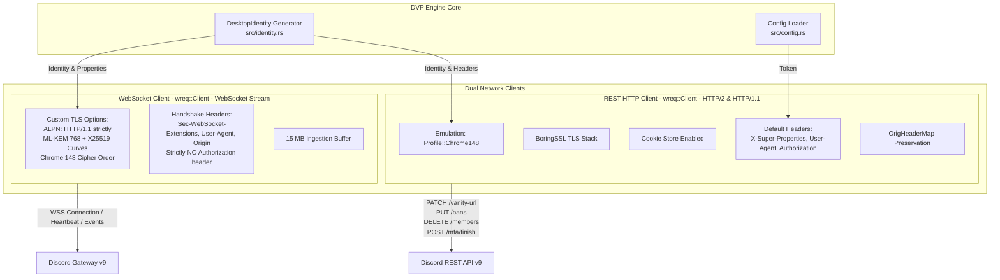

# DVP System Architecture & Engine Specification

The Discord Vanity Protector (DVP) engine is a high-performance, asynchronous vanity URL preservation and attacker mitigation daemon written in Rust. It impersonates an official Discord Windows Desktop client (Chromium 148 / Electron) at the network layer using BoringSSL TLS fingerprinting, JA3/JA4 emulation, and HTTP/2 protocol negotiation.

---

## 1. Architectural Principles

### 1.1 Non-Blocking Asynchronous Runtime
DVP is built entirely on top of the `tokio` multi-threaded asynchronous runtime. Network I/O operations (WebSocket ingestion, HTTP/2 REST mutations, Webhook dispatches) execute concurrently on lightweight cooperative tasks without blocking worker threads.

### 1.2 Thread-Safe Concurrent State Synchronization
Global session state (`SessionState`) and multi-factor authorization tokens (`MfaCache`) use lock-free atomic primitives (`AtomicBool`, `AtomicI64`, `AtomicU64`) and fine-grained `tokio::sync::RwLock` / `std::sync::RwLock` structures. Hot paths read sequence numbers, timestamps, and cached tokens with zero lock contention.

### 1.3 Zero-Allocation & Sub-Millisecond Fast Paths
Critical mitigation paths (such as `fast` mode vanity reversion and cached MFA patch requests) avoid unnecessary allocations and JSON parsing overhead, achieving internal engine dispatch latencies under **500 microseconds** (\(\le 0.5\text{ ms}\)).

### 1.4 Resilient Error Isolation & Crash Prevention
All top-level tasks and C ABI FFI boundaries are guarded against unwinding panics using custom panic hooks and isolated task spawning. Network failures trigger exponential backoff with randomized jitter to prevent rate-limit cascading.

---

## 2. System Architecture Diagrams

### 2.1 Full End-to-End System Event Lifecycle



---

### 2.2 Multi-Mode Decision Matrix



---

### 2.3 On-Demand Password MFA Elevation State Machine

Discord requires MFA authorization for sensitive guild modifications. DVP implements an on-demand password elevation state machine with in-memory token caching for 270 seconds:



---

### 2.4 Dual Client Networking Architecture



---

## 3. Module-by-Module Technical Breakdown

### 3.1 `src/build.rs` — Dynamic Client Build Metadata Resolution
`build.rs` resolves Discord Desktop client versions dynamically to ensure super-properties match current production builds:

- **Resolution Tiers**:
  1. **Tier 1 (Remote Provider)**: Queries remote endpoint `https://cordapi.dolfi.es/api/v2/properties/windows` with a 3-second timeout for synchronized client versions, Electron versions, and Chrome build numbers.
  2. **Tier 2 (Official Web Scrape Fallback)**: Scrapes `https://discord.com/login` using regular expression `r#""BUILD_NUMBER":\s*"(\d+)""#` and queries the official update CDN `https://updates.discord.com/distributions/app/manifests/latest?channel=stable&platform=win&arch=x64` for host module version strings.
  3. **Tier 3 (Baseline Default)**: Falls back to compile-time default constants (`client_version: "1.0.9256"`, `native_build_number: 89799`, `client_build_number: 607562`, `electron_version: "42.9.0"`, `chrome_version: "148.0.7778.280"`).

---

### 3.2 `src/identity.rs` — Client Identity & Super-Properties Generation
Constructs the serialized JSON super-properties header and gateway handshake payload:

- **Launch Signature Masking (`generate_launch_signature`)**:
  Clears 12 mod-detection bit positions across a 128-bit UUID integer to eliminate client-modification flags:
  $$\text{mod\_bits} = 2^{119} \mid 2^{108} \mid 2^{100} \mid 2^{91} \mid 2^{84} \mid 2^{75} \mid 2^{61} \mid 2^{55} \mid 2^{48} \mid 2^{38} \mid 2^{24} \mid 2^{11}$$
  $$\text{clean\_signature} = \text{random\_uuid}_{128} \ \& \ \sim\text{mod\_bits}$$
- **Encoding**: Serializes super-properties into standard Base64 for the `X-Super-Properties` HTTP header.
- **Gateway Properties**: Injects `"is_fast_connect": false` and `"gateway_connect_reasons": "AppSkeleton"`.

---

### 3.3 `src/client.rs` — BoringSSL Client Construction
Constructs specialized `wreq` clients:

- **REST HTTP Client (`create_http_client`)**:
  - Uses `Profile::Chrome148` with `Platform::Windows`.
  - Configures cookie persistence (`cookie_store(true)`).
  - Preserves HTTP header case ordering via `OrigHeaderMap`.
  - Attaches `Authorization`, `X-Super-Properties`, `X-Discord-Locale: en-US`, `X-Discord-Timezone: UTC`.
- **Gateway WebSocket Client (`create_ws_client`)**:
  - Enforces ALPN protocol list strictly to `[AlpnProtocol::HTTP1]`.
  - Post-Quantum TLS key exchange (`X25519MLKEM768`, `X25519`, `P-256`, `P-384`).
  - Strict cipher suite ordering with Chrome GREASE and OCSP stapling enabled.
  - Omits `Authorization` header during WebSocket upgrade handshake.

---

### 3.4 `src/gateway.rs` — Resilient Gateway Engine
Manages the real-time Discord Gateway connection over WebSocket:

- **Ingestion Buffer**: 15 MB read buffer (`read_buffer_size(15 * 1024 * 1024)`).
- **Opcode Lifecycle**:
  - **Opcode 10 `HELLO`**: Reads `heartbeat_interval` (default 41,250 ms), spawns background jittered heartbeat loop.
  - **Opcode 40 QoS Heartbeat**: Sends foregrounded QoS pings (`"ver": 27`, `"reasons": ["foregrounded"]`, sequence number).
  - **Opcode 1 Heartbeat**: Responds immediately with current sequence number when requested by Discord.
  - **Opcode 2 `IDENTIFY`**: Dispatches full identity payload with capabilities bitmask `1734653`.
  - **Opcode 6 `RESUME`**: Dispatches session resumption when `session_id` and sequence number are present.
  - **Opcode 7 / Opcode 9 Reconnect**: Automatically triggers session resumption or fresh re-identification.
- **Zombie Socket Detection**: Measures silence against threshold $T_{\text{silence}} = (\text{interval} / 1000) + 20\text{ seconds}$. If no packets are received, the dead socket is forcefully terminated.
- **Circuit Breaker (`BackoffCircuitBreaker`)**: Exponential backoff $D = \text{base} \times 2^{\min(\text{exp}, \text{max})}$ with randomized jitter ($0.5\text{s} \le \text{delay} \le D$).
- **Event Deduplication**: 3000 ms atomic timestamp cooldown window prevents duplicate revert execution from concurrent gateway events.

---

### 3.5 `src/revert.rs` — Sub-Millisecond Vanity Reversion
Executes the `PATCH /api/v9/guilds/{guild_id}/vanity-url` request:

- **`MfaCache`**: Thread-safe in-memory cache with 270-second TTL (`Duration::from_secs(270)`).
- **Fast Path**: Reuses cached `X-Discord-MFA-Authorization` header, executing in $< 50\text{ ms}$ over HTTP/2.
- **Elevation Path**: If 401 is received, parses `mfa.ticket`, sends `POST /api/v9/mfa/finish` with account password, caches the resulting MFA token, and retries the vanity patch.

---

### 3.6 `src/punish.rs` — Attacker Punishment Subsystem
Mitigates malicious actors concurrently with vanity recovery:

- **Actions**:
  - `"ban"`: Executes `PUT /api/v9/guilds/{guild_id}/bans/{user_id}` with `delete_message_seconds: 0`.
  - `"kick"`: Executes `DELETE /api/v9/guilds/{guild_id}/members/{user_id}`.
- **Audit Reason**: Attaches `X-Audit-Log-Reason: unauthorized vanity url change`.
- **Parallel Dispatch**: In `gateway.rs`, `revert::revert_vanity` and `punish::punish_executor` run concurrently using `tokio::join!`.

---

### 3.7 `src/audit.rs` — REST Fallback Executor Resolution
Used in `normal` mode when gateway audit log dispatch is unavailable:

- Queries `GET /api/v9/guilds/{guild_id}/audit-logs?action_type=1&limit=5`.
- Filters for `action_type == 1` (`GUILD_UPDATE`) and checks `changes` array for keys `vanity_url_code`, `vanity_url`, or `vanityURLCode`.
- Resolves the attacker's `user_id`.

---

### 3.8 `src/notify.rs` — Non-Blocking Webhook Alert Dispatch
Dispatches rich Discord embeds to the configured webhook URL:

- **Zero Gateway Blocking (`spawn_attack_alert`)**: Detaches alert dispatch to a background task using `tokio::spawn`.
- **Dual Latency Tracking**:
  - `engine_latency_us`: Microsecond-precision processing time within the Rust engine.
  - `total_elapsed_ms`: Total round-trip time from event detection to REST confirmation.
- **Manager Mentions**: Auto-formats `<@user_id>` pings for configured server managers.

---

### 3.9 `src/validator.rs` — Background Token Health Monitor
Monitors account authorization health:

- Executes `GET /api/v9/users/@me` at configurable intervals (default: 2.0 hours).
- On `401 Unauthorized`, sends an emergency critical alert to the designated webhook URL.

---

### 3.10 `src/ffi.rs` — C FFI Entry Point & Runtime Isolation
Exports the C ABI function for cross-language loaders:

```rust
#[unsafe(no_mangle)]
pub unsafe extern "C" fn dvp_start(config_path_ptr: *const c_char) -> i32;
```

- **Thread Pool Creation**: Builds a dedicated multi-threaded `tokio::runtime::Builder::new_multi_thread()` instance on a background OS thread.
- **Atomic Concurrency Guard**: `RUNNING: AtomicBool` ensures only one instance runs per process.
- **Safety Boundary**: Catches invalid C strings and isolates uncaught panics.

---

### 3.11 `src/config.rs` — Strongly Typed Configuration
Parses and validates `config.toml`:

- Enforces the strict security rule: `managers` array cannot exceed **2** user IDs.
- Provides helper methods `is_manager(user_id)` and `is_whitelisted(user_id)`.

